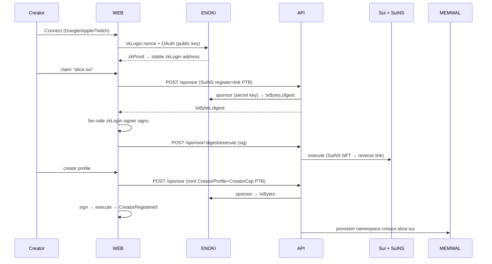
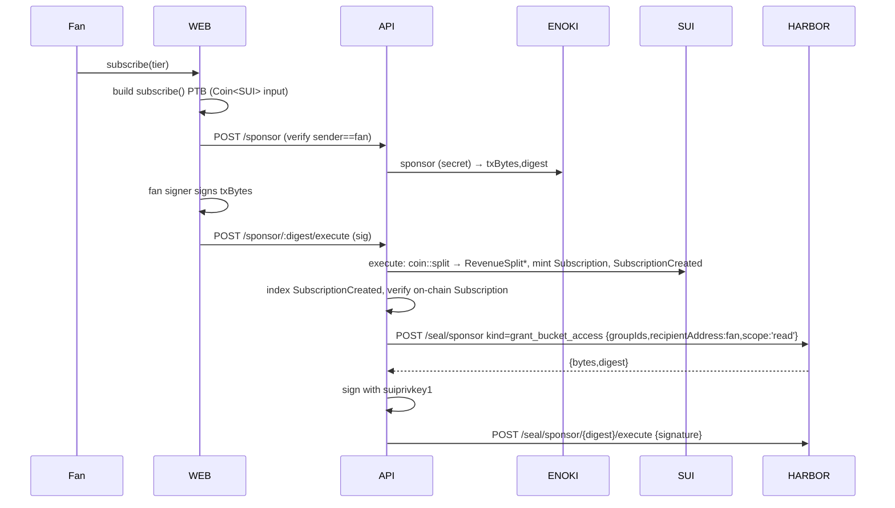
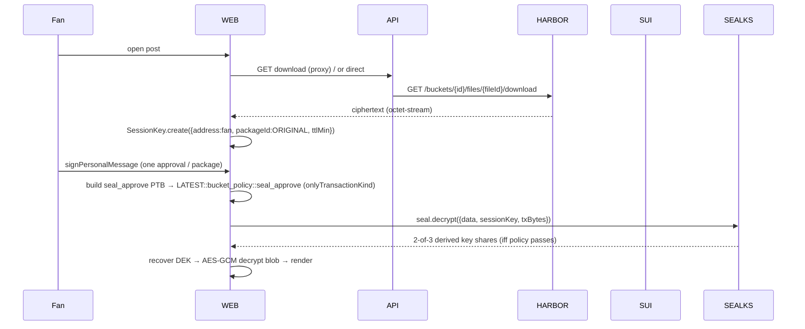
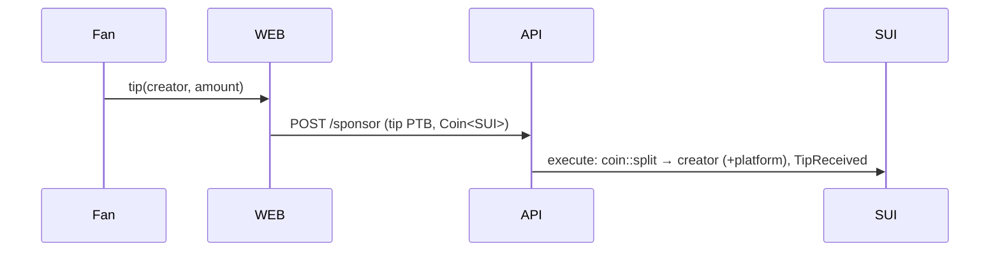
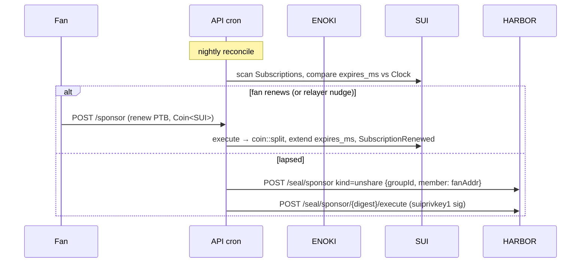
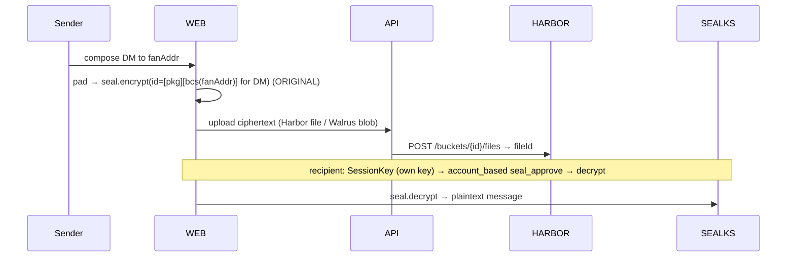
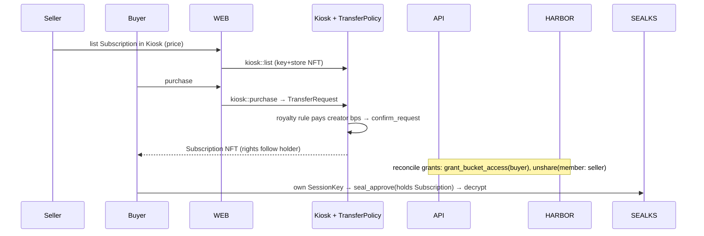

# End-to-end data flows — subscribe, publish, unlock, tip, message, resell

> Status: **design / docs-only** (June 2026). Build target = **Sui testnet** first (Harbor and
> memwal are testnet/beta). This is a **synthesis** doc: it stitches the primitives from the
> per-technology references into the nine concrete sequences WalrusUrchin actually runs. It does
> **not** re-explain primitives — for that, follow the cross-links. The canonical object model,
> trust invariants, and per-network IDs/versions live in [`architecture.md`](./architecture.md)
> (§4, §3, §8 respectively); this doc assumes them.

Each flow below names the **actors**, the **exact SDK/REST/Move calls**, **which key signs**, what
is **on-chain vs off-chain**, and the **failure/retry modes**. Read this alongside
[`sui.md`](./sui.md) (PTBs, Kiosk, splits), [`seal.md`](./seal.md) (encrypt/`seal_approve`/SessionKey),
[`walrus.md`](./walrus.md) (blobs/epochs), [`suins.md`](./suins.md) (handles), [`auth.md`](./auth.md)
(zkLogin/Enoki sponsorship), [`habour.md`](./habour.md) (the managed Walrus+Seal API — file is
`habour.md`, product is "Harbor"), [`memwal.md`](./memwal.md) (agent memory), and
[`monorepo.md`](./monorepo.md) (where each call physically lives).

## Conventions used in every diagram

| Symbol | Meaning |
| --- | --- |
| `WEB` | `apps/web` — Vite 8 SPA, world-readable, holds only the **Enoki public** key |
| `API` | `apps/api` — Hono 4.12, **the trust boundary**; holds Enoki **secret**, Harbor `hbr_`/`suiprivkey1`, memwal delegate key |
| `SUI` | Sui testnet fullnode (`https://fullnode.testnet.sui.io:443`, gRPC) |
| `ENOKI` | Enoki sponsorship + zkLogin proving service |
| `HARBOR` | `https://api.testnet.harbor.walrus.xyz` (Walrus + Seal gateway) |
| `SEALKS` | Seal key servers (Harbor's 3 **pinned** servers, threshold **2-of-3**, `verifyKeyServers:false`) |
| `MEMWAL` | memwal relayer (`https://relayer.staging.memwal.ai` on testnet) |

**Who signs what (recurring rule):** the **fan's** zkLogin/Enoki signer signs *user* transactions
(subscribe/tip/PPV) and *their own* Seal `SessionKey`. The **Enoki secret** key in `API` sponsors gas
(pays, never authorizes the user's intent). The **Harbor `suiprivkey1` service key** in `API` signs
only Harbor bucket-lifecycle and grant PTBs. The **memwal delegate key** in `API` signs memory writes.
A secret never leaves `API`; the fan never receives the service key (see
[`architecture.md`](./architecture.md) §3, §5).

---

## 1. Creator onboarding (zkLogin → SuiNS → CreatorProfile/Cap → memwal)

**Actors:** creator (browser) · `WEB` · `API` · `ENOKI` · `SUI` · SuiNS package · `MEMWAL`.

A creator signs in passwordlessly, claims a portable `creatorname.sui` handle, mints their on-chain
profile + capability, and gets an agent-memory namespace provisioned. Every write is Enoki-sponsored so
the creator never needs SUI.



**Steps**

1. **zkLogin sign-in.** `WEB` runs the new dapp-kit Enoki wallet (`registerEnokiWallets` into
   `createDAppKit`, holding only the **Enoki public** key). OAuth + Enoki proving yields a **stable**
   zkLogin address derived from `(iss, aud, user_salt)` — Enoki owns the salt; the OAuth client id is
   pinned per environment. See [`auth.md`](./auth.md). *On-chain:* nothing yet.
2. **SuiNS register + link.** `WEB` builds a PTB that registers `alice.sui` (SuiNS core package, see
   [`architecture.md`](./architecture.md) §8 for pkg/object IDs) and sets the **reverse record** so
   address→name resolves. `API` `/sponsor` wraps it (Enoki **secret** pays gas); the **creator's** signer
   signs; `API` `/sponsor/:digest/execute` submits. *On-chain:* a SuiNS name NFT (owned, tradable) +
   reverse link. See [`suins.md`](./suins.md).
3. **Mint CreatorProfile + CreatorCap.** Second sponsored PTB calls `walrus_urchin` to create the
   **shared** `CreatorProfile` (`handle` references the SuiNS name; `display`, `payout`,
   `platform_fee_bps`) and transfer the **owned** `CreatorCap` to the creator. Emits
   **`CreatorRegistered`**. The cap is the only authority for later admin calls (capability pattern, never
   `msg.sender`). *On-chain:* `CreatorProfile` (shared) + `CreatorCap` (owned).
4. **Provision memwal.** `API` calls `remember()` on the single platform `MemWalAccount` (delegate key)
   under namespace **`creator:alice.sui`** with brand-voice/onboarding facts. memwal is **agent memory
   only**, not media (see [`memwal.md`](./memwal.md)). *Off-chain:* namespace is flat, exact-match;
   `remember()` always **appends** (dedup at app layer). `kb:<creatorId>` is reserved for the RAG knowledge
   base.

**On-chain:** SuiNS NFT + reverse link; `CreatorProfile` (shared); `CreatorCap` (owned); `CreatorRegistered`.
**Off-chain:** zkProof/salt (Enoki), memwal namespace seed.
**Failure/retry:** zkProof expiry → re-fetch proof (ephemeral key TTL). SuiNS name taken → 409-style abort,
prompt new handle. **Salt drift = permanent loss** of address/handle/content access — pin the OAuth client id
and let Enoki own the salt ([`architecture.md`](./architecture.md) §3). Sponsor digest is short-lived → if
`/execute` is slow, re-`/sponsor`. `subscribeEvent` is deprecated → index `CreatorRegistered` by polling
GraphQL/RPC.

---

## 2. Creator publishes encrypted content — **Path A (Harbor-managed, MVP)**

**Actors:** creator · `WEB` · `API` (holds `hbr_` + `suiprivkey1`) · `HARBOR` · `SEALKS` · `SUI`.

The mandated default. Backend owns the bucket lifecycle; **media is encrypted client-side before upload**
so Harbor only ever stores ciphertext. For large media use **envelope encryption** (AES-256-GCM DEK encrypts
the blob; Seal encrypts only the small DEK) so key-server committee/threshold — **frozen into the ciphertext
at encrypt time** — can be rotated later without re-upload. Full Harbor surface in [`habour.md`](./habour.md).

```mermaid
sequenceDiagram
    participant C as Creator
    participant WEB
    participant API
    participant HARBOR
    participant SUI
    C->>API: create bucket (creatorId-tierId)
    API->>HARBOR: POST /spaces/{id}/buckets {scope:'private'}
    HARBOR-->>API: {bucket_id, bytes, digest, state:pending_policy}
    API->>API: sign bytes with suiprivkey1
    API->>HARBOR: POST /buckets/{id}/finalize {signature}
    HARBOR-->>API: {seal_policy_id, state:active}
    C->>WEB: pick media
    WEB->>WEB: AES-GCM DEK encrypts blob; seal.encrypt(DEK) → id=bcs{policyObjectId,nonce}
    WEB->>API: multipart upload (ciphertext)
    API->>HARBOR: POST /buckets/{id}/files
    HARBOR-->>API: 202 {fileId}
    loop poll
        API->>HARBOR: GET .../files/{fileId}/status
        HARBOR-->>API: state: queued|active|completed|failed
    end
    WEB->>API: POST /sponsor (publish Content PTB)
    API->>SUI: store {bucket_id,file_id,seal_policy_id} → ContentPublished
```

**Steps**

1. **Reserve bucket.** `POST /api/v1/spaces/{id}/buckets {name, scope:'private'}` → `201
   {bucket_id, bytes(base64 Enoki-sponsored tx), digest, state:'pending_policy'}`. Public buckets are
   **disabled in alpha** — always `private`. Name deterministically (`creatorId-tierId`) to avoid stale
   `pending_policy` collisions.
2. **Sign + finalize.** `API` signs `bytes` with the **`suiprivkey1` service key** (`Ed25519Keypair.fromSecretKey(decodeSuiPrivateKey(...))`,
   `signTransaction(fromBase64(bytes))`), then `POST /buckets/{id}/finalize {signature}` → `200
   {seal_policy_id, state:'active'}`. This is the on-chain `BucketAdmin` grant. Do the reserve→sign→finalize
   as **one tight synchronous sequence** in `API` (sponsor sigs expire fast).
3. **Encrypt client-side.** In `WEB`: generate per-file AES-256-GCM DEK, encrypt the media, then
   `seal.encrypt({ threshold: 2, packageId: HARBOR_ORIGINAL_PACKAGE_ID, id, data: DEK })` where
   `id = bcs.struct{ policyObjectId: seal_policy_id, nonce: 32 random bytes }` serialized to hex. SealClient
   uses Harbor's **3 pinned** key servers with `verifyKeyServers:false`, threshold **2-of-3**.
   **Discard the `key` field** `encrypt` returns (it is a policy-bypassing DEM copy) unless you have a real
   DR requirement. See [`seal.md`](./seal.md).
4. **Upload ciphertext + poll.** `POST /api/v1/buckets/{id}/files` (multipart `file`, optional `name`,
   `metadata` JSON ≤8KB — stash `{tierId, postId, previewBlobId}` for un-decrypted feed rendering) → `202
   {fileId}`. Poll `GET .../files/{fileId}/status` to **`completed`** (enum `queued|active|completed|failed`).
5. **Publish on-chain.** Sponsored PTB stores the `Content`/`Post` object with `storage ref =
   {bucket_id, file_id, seal_policy_id}`, `tier_id`, `is_encrypted:true`, optional unencrypted
   `preview_blob`. Emits **`ContentPublished`**. *On-chain:* `Content` refs + metadata only — media stays
   encrypted on Walrus.

**On-chain:** `seal_policy_id` (bucket-group) at finalize; `Content`/`Post` object; `ContentPublished`.
**Off-chain:** ciphertext blob + DEK ciphertext on Walrus via Harbor; preview blob.
**Failure/retry:** First upload(s) after finalize → **`403 mirror_missing_grant`** (ACL indexer lag);
retry every ~3s, ≤20 attempts, show "provisioning." `bucket_not_finalized` / `bucket_not_in_scope` → re-run
reserve (note: `digest_expired` is **prose-only**, *not* in the error enum — do not branch on it). Bare `429`
on upload → exponential backoff. `payload_too_large` / `quota_exceeded` (422 `PLAN_LIMIT_EXCEEDED`) → surface
storage caps. **Never** upload plaintext — that is a permanent, irreversible leak.

> **Path B (north star, summary).** Self-managed Seal: encrypt against **our** `walrus_urchin` package id,
> store ciphertext on Walrus (Harbor opaque blob *or* `@mysten/walrus` Upload Relay), and gate with
> `walrus_urchin::access_policy::seal_approve` reading the fan's on-chain `Subscription`/`Entitlement`
> directly — no backend mediation, no custodial service key. Both paths sit behind the same
> `StorageProvider`/`AccessPolicy` interface ([`architecture.md`](./architecture.md) §5, §7).

---

## 3. Fan subscribes (sponsored `subscribe()` → revenue split → NFT → grant)

**Actors:** fan · `WEB` · `API` (Enoki secret + `suiprivkey1`) · `ENOKI` · `SUI` · `HARBOR`.

A fan buys a tier. Payment splits transparently on-chain in the **same atomic PTB**; the fan receives a
`Subscription` NFT; then `API` grants the fan's address Harbor decrypt access so they can later decrypt
**client-side with their own SessionKey** (no service key handed to fans).



**Steps**

1. **Build `subscribe()` PTB.** `WEB` constructs a PTB (via `packages/move-client` bindings) calling
   `walrus_urchin::...::subscribe(fee: Coin<SUI>, tier, profile, clock, ctx)`. The Move fn asserts
   `fee == tier.price`.
2. **Sponsor.** `POST /api/v1/.../sponsor`. The route **verifies `sender == authenticated fan`** before
   sponsoring (the gas pool can't be drained) and that the Move target is allowlisted. Enoki **secret** key
   signs as sponsor. See [`auth.md`](./auth.md).
3. **Sign + execute.** The **fan's** signer signs `txBytes`; `/sponsor/:digest/execute` submits. In the
   same atomic tx the contract `coin::split`s `fee` across `tier.revenue_split` (creator + collaborators +
   platform fee + optional referrer), emits one **`RevenueSplit`** per recipient, mints the
   `Subscription` (sets `started_ms`, `expires_ms = started_ms + tier.period_ms`), and emits
   **`SubscriptionCreated`**. *On-chain:* split balances + `Subscription` NFT (transferable tier = `key+store`;
   soulbound perk = `key`-only).
4. **Backend grants Harbor access.** `API` indexes `SubscriptionCreated`, re-verifies the on-chain
   `Subscription`, then `POST /api/v1/seal/sponsor` `kind=grant_bucket_access`
   `{groupIds:[seal bucket group], recipientAddress: fan address, scope:'read'}` → `{bytes, digest}`;
   `API` signs with **`suiprivkey1`**; `POST /seal/sponsor/{digest}/execute {signature}`. Map tiers to
   **Seal groups**, not separate buckets, so membership changes need no re-upload.

**On-chain:** split `Coin` transfers; `Subscription` NFT; `RevenueSplit`×N + `SubscriptionCreated`; the
grant PTB.
**Off-chain:** Enoki sponsorship; Harbor grant execution.
**Failure/retry:** `fee != tier.price` → tx aborts (re-quote). Sponsor digest expiry → re-`/sponsor`.
Grant is **eventually-consistent** → the fan's first decrypt may `403 mirror_missing_grant`; retry ~3s
(handled in flow 4). Idempotency: key the grant on `(tierId, fanAddr)` so a re-indexed event doesn't
double-grant.

---

## 4. Fan unlocks / views content (download → `seal_approve` → SessionKey → decrypt)

**Actors:** fan · `WEB` · `API` · `HARBOR` · `SEALKS` · `SUI`.

After subscribing (flow 3 granted the address), the fan decrypts **entirely client-side**. Harbor serves
only ciphertext; the access decision is enforced by **Seal key servers** via the on-chain `bucket_policy`,
not by Harbor's REST ACL.



**Steps**

1. **Download ciphertext.** `GET /api/v1/buckets/{id}/files/{fileId}/download` streams raw Seal ciphertext
   (`Cache-Control: private, no-store`). Optionally `EncryptedObject.parse(bytes)` to read `.id/.packageId/.threshold/.services`.
2. **SessionKey.** `SessionKey.create({ address: fan, packageId: HARBOR_ORIGINAL_PACKAGE_ID, ttlMin, suiClient })`,
   `getPersonalMessage()` → the **fan** signs via wallet `signPersonalMessage` → `setPersonalMessageSignature()`.
   One approval authorizes key fetches for `ttlMin`; persist in IndexedDB (`export`/`import`) so browsing many
   posts signs once. (With an EnokiSigner you can pass `signer` to skip the prompt.)
3. **Build `seal_approve` PTB.** Target `${HARBOR_LATEST_PACKAGE_ID}::bucket_policy::seal_approve(idBytes,
   seal_policy_id)`, built with `tx.build({ client, onlyTransactionKind: true })`. It must call **only**
   `seal_approve*`, same package, **never broadcast/composed** with other commands.
4. **Decrypt.** `seal.decrypt({ data, sessionKey, txBytes })`. Key servers run the PTB via
   `dry_run_transaction_block`; on policy pass they release **2-of-3** shares; SDK recovers the DEK; `WEB`
   AES-GCM-decrypts the media and renders. For many blobs, `fetchKeys({ ids ≤10, txBytes, sessionKey,
   threshold })` then local-only `decrypt`.

**On-chain:** nothing written (dry-run only). **Off-chain:** ciphertext download; SessionKey signature;
key-share fetch.
**Failure/retry:** **`mirror_missing_grant`** right after purchase → "unlocking access," retry ~3s.
`NoAccessError` → grant truly missing/lapsed (reconcile, flow 7). Key-server `InvalidParameter` on
stale/just-created objects → retry after a few seconds. Wrong package id (must be **`ORIGINAL`** for
encrypt/SessionKey, **`LATEST`** for the decrypt PTB) or generic allowlist servers instead of Harbor's
pinned set → decrypt fails. **Caveat:** a DEK already pulled within a SessionKey TTL is retained — lapsing
stops *future* decryption of *new/rotated* content, not re-viewing already-decrypted bytes
([`architecture.md`](./architecture.md) §3). The **envelope DEK** is what limits the Seal payload to tens of
bytes and lets committee/threshold rotate without re-upload.

---

## 5. PPV one-off purchase (key_request pattern → soulbound `Entitlement`)

**Actors:** fan · `WEB` · `API` · `ENOKI` · `SUI` · `SEALKS`.

A single paid post/rental. Uses Seal's **key_request** pattern so the expensive/paid policy check stays
**out of** the dry-run-safe `seal_approve`, binding access to one buyer + an expiry.

```mermaid
sequenceDiagram
    participant F as Fan
    participant WEB
    participant API
    participant SUI
    participant SEALKS
    F->>WEB: buy PPV(content)
    WEB->>API: POST /sponsor (buy_ppv PTB, Coin<SUI>)
    API->>ENOKI: sponsor → txBytes
    WEB->>WEB: fan signs → execute
    API->>SUI: coin::split (RevenueSplit*), mint Entitlement/PpvAccess, PpvPurchased
    F->>WEB: open PPV
    WEB->>WEB: mint KeyRequest{inner_id=blob-bound,user,valid_till}; SessionKey signed by fan
    WEB->>SEALKS: seal_approve → req.verify(WITNESS,id,sender,clock) → decrypt
```

**Steps**

1. **Buy.** Sponsored PTB calls `buy_ppv(fee: Coin<SUI>, content, ...)`: asserts price, `coin::split`s the
   revenue split (**`RevenueSplit`**), and mints a **soulbound `Entitlement`/`PpvAccess`** (`key`-only, no
   `store`) with `content_id` (blob-bound), `buyer`, `valid_till`. Emits **`PpvPurchased`**. The fan's signer
   signs; Enoki sponsors.
2. **Unlock.** The `key_request` pattern: a `KeyRequest{ package, inner_id, user, valid_till }` is minted
   after the purchase check, and `seal_approve` only calls `req.verify(WITNESS, id, sender, clock)`. The fan
   builds the `onlyTransactionKind` PTB, signs a **SessionKey** (fan key), `seal.decrypt`. Bind the inner-id
   to the specific Walrus blob (`serviceId || blobId || nonce`) so one PTB can't unlock another file.

**On-chain:** split transfers; `Entitlement`/`PpvAccess` (owned, soulbound); `PpvPurchased`.
**Off-chain:** SessionKey decrypt. **Failure/retry:** under Path A, the same `grant_bucket_access` for the
fan address applies (PPV bucket/group); `mirror_missing_grant` retry as in flow 4. Expired `valid_till`
(e.g. 48h rental) → `seal_approve` aborts → re-purchase. Keep the paid check out of `seal_approve` (it must
be side-effect-free for dry-run).

---

## 6. Tip (Coin transfer + optional split + event)

**Actors:** fan · `WEB` · `API` · `ENOKI` · `SUI`.

The simplest flow: a direct value transfer, optionally split, with an on-chain event. **No NFT, no Seal.**



**Steps**

1. **Build + sponsor.** `WEB` builds `tip(coin: Coin<SUI>, profile, ...)`; `API` `/sponsor` (Enoki secret),
   fan signs, `/execute`.
2. **Settle.** Contract transfers to the creator's `payout` address (optionally `coin::split` for a small
   platform fee per the profile's `platform_fee_bps`) and emits **`TipReceived`**. *On-chain:* transfer +
   event. *Off-chain:* nothing (optionally `API` `remember()`s the tip under `fan:<addr>` for recommendation
   nudges — appends only, [`memwal.md`](./memwal.md)).

**Failure/retry:** insufficient `Coin` → abort. Sponsor expiry → re-`/sponsor`. USDC tips use a
`Coin<USDC>` input on the same path.

---

## 7. Subscription lapse / renew (pull-based `renew()` + `unshare_bucket_access` reconcile)

**Actors:** fan (renew) · `API` indexer/cron (reconcile) · `ENOKI` · `SUI` · `HARBOR`.

**There is no on-chain cron** → renewals are **pull-based** `renew()` transactions (manual, or
relayer-driven and Enoki-sponsored). A reconciliation job mirrors on-chain subscription state into Harbor
Seal grants — revoking decrypt access on lapse.



**Steps**

1. **Detect.** `API` cron scans `Subscription` objects (or replays `SubscriptionCreated`/`SubscriptionRenewed`
   events) and compares `expires_ms` to the on-chain `Clock`.
2. **Renew.** Fan (or an Enoki-sponsored relayer nudge) submits `renew(fee: Coin<SUI>, sub, tier, clock)`:
   re-splits revenue (**`RevenueSplit`**), extends `expires_ms`, emits **`SubscriptionRenewed`**. The fan's
   signer signs; Enoki sponsors.
3. **Reconcile on lapse.** For lapsed subs, `API` calls `POST /api/v1/seal/sponsor`
   `kind=unshare {groupId, member: fanAddr}` → `/execute` (signed with **`suiprivkey1`**), revoking the lapsed
   fan's group membership (member-level). The separate `unshare_bucket_access {groupId, serviceSignerAddress}`
   kind removes a *service signer* from a whole bucket — not what you want for a fan address.

**On-chain:** `renew()` split + `SubscriptionRenewed` + extended `expires_ms`; the unshare PTB.
**Off-chain:** cron scan; Harbor grant revocation. **Failure/retry:** grants are eventually-consistent —
allow lag before treating a still-decrypting fan as a bug. Revocation only stops **future** key fetches
(already-pulled DEKs persist; mitigate with short SessionKey TTLs + per-version nonces). Idempotent unshare
keyed on `(groupId, fanAddr)`. Walrus blobs are prepaid for N epochs — a separate renewal job must keep the
backing blobs alive or live content goes dark ([`architecture.md`](./architecture.md) §3).

---

## 8. Supporter-only message / DM (account_based or allowlist Seal, encrypted blob)

**Actors:** creator/fan · `WEB` · `API` · `HARBOR`/Walrus · `SEALKS` · `SUI`.

Messages are just small encrypted blobs gated by Seal — 1:1 DMs use the **account_based** pattern; tier-wide
"supporter-only" posts reuse the **allowlist** (or the same `subscription` `seal_approve` as content).



**Steps**

1. **Encrypt.** 1:1 DM: `account_based` id = `[packageId][bcs(recipientAddr)]` — **only that address** can
   derive the key. Supporter-only group post: `allowlist`/`whitelist` (`seal_approve` checks
   `addresses.contains(sender)`) or the tier `subscription` policy (hold a non-expired `Subscription`).
   **Pad short messages** before encrypt — Seal does not hide plaintext length. Encrypt with
   `HARBOR_ORIGINAL_PACKAGE_ID` (Path A) or our package (Path B).
2. **Store.** Upload ciphertext as a Harbor file (or raw Walrus blob, Path B). For DMs, namespace memory
   context under `dm:<creatorId>:<fanAddr>` in memwal if an AI concierge is involved (separate path, plaintext
   only via `MemWalManual` for E2E — [`memwal.md`](./memwal.md)).
3. **Read.** Recipient builds the `account_based`/`allowlist` `seal_approve` PTB, signs their **own**
   SessionKey, `seal.decrypt`.

**On-chain:** the allowlist/account object + `seal_approve` (dry-run only on read). **Off-chain:** ciphertext
blob; memory context. **Failure/retry:** allowlist membership change takes effect for **future** fetches only.
Group membership for supporter-only is driven by the same `grant_bucket_access`/`unshare` plumbing (flows 3/7).
Stale-state `seal_approve` retry as in flow 4.

---

## 9. Transferable subscription resale (Kiosk + TransferPolicy royalty → rights move with the NFT)

**Actors:** seller (current holder) · buyer · `WEB` · `SUI` (Kiosk/TransferPolicy) · `HARBOR` · `SEALKS`.

For **transferable** tiers (`key + store`), the `Subscription` NFT trades in a **Kiosk** under a
**TransferPolicy** that enforces a royalty to the creator. Because `seal_approve` gates on **holding the
object**, decryption rights move with the NFT automatically — a Patreon-impossible feature.



**Steps**

1. **List.** Seller places the `Subscription` (must be `key + store`; soulbound `key`-only perks **cannot**
   be resold) into a Kiosk and `kiosk::list`s it. See [`sui.md`](./sui.md) for Kiosk/TransferPolicy.
2. **Purchase + royalty.** Buyer `kiosk::purchase`; the resulting `TransferRequest` must satisfy the
   **TransferPolicy** royalty rule (creator royalty bps + lock) before `confirm_request` — the creator earns
   on resale. *On-chain:* NFT ownership transfer + royalty payment (honored where marketplaces enforce the
   policy).
3. **Rights follow the holder.** For **Path B** the buyer immediately satisfies
   `walrus_urchin::access_policy::seal_approve` (it reads the `Subscription` the buyer now holds) — **no
   backend step**. For **Path A** the Seal grant is keyed to an *address*, so `API`'s reconcile job must
   `grant_bucket_access(buyer)` and `unshare {groupId, member: seller}` (member-level revoke) to mirror the transfer.

**On-chain:** Kiosk listing/purchase; royalty payment; NFT transfer. **Off-chain (Path A only):** Harbor
grant re-keying. **Failure/retry:** the buyer can access content the seller already decrypted within a live
SessionKey TTL — mitigate with per-version Seal identities/nonces. Path A grant lag → `mirror_missing_grant`
retry. Mismatched `expires_ms` (buyer inherits the remaining period) — surface remaining time at listing.

---

## Gotchas

- **Two package ids, do not swap.** `encrypt` + `SessionKey.create` use **`HARBOR_ORIGINAL_PACKAGE_ID`**;
  the decrypt `seal_approve` PTB targets **`HARBOR_LATEST_PACKAGE_ID`**. Swapping silently breaks DEK
  derivation after a package upgrade. Use Harbor's **3 pinned** key servers with `verifyKeyServers:false`,
  threshold **2-of-3** — **not** `getAllowlistedKeyServers('testnet')`.
- **`mirror_missing_grant` is normal, not a denial.** Grants (finalize, `grant_bucket_access`) are
  eventually-consistent; the first access after finalize/purchase/transfer can `403`. Retry ~3s ≤20×, show
  "unlocking access." `NoAccessError` (from key servers) is the *real* denial.
- **Error-enum discipline.** The live OpenAPI enum has `bucket_not_finalized`/`bucket_not_in_scope`;
  **`digest_expired` is prose-only** — never branch on it. Upload status terminal state is **`completed`**
  (enum `queued|active|completed|failed`).
- **`seal_approve` is dry-run, side-effect-free, single-package.** Build with `onlyTransactionKind:true`,
  call only `seal_approve*` in the same package, **never compose** payment/transfer commands or broadcast it.
  Key servers may see **stale state** → retry after a few seconds; never gate on just-created objects.
- **Decryption is not revocation.** Lapsing/unsharing stops **future** key fetches only; DEKs pulled within a
  live SessionKey TTL persist. Mitigate with short TTLs + per-content-version nonces. For large media use the
  **envelope DEK** so committee/threshold (frozen at encrypt time) can rotate without re-upload.
- **Secrets stay in `apps/api`.** Enoki **secret**, Harbor `hbr_` + `suiprivkey1`, memwal delegate key never
  reach the SPA (world-readable on Walrus Sites). Fans get **grants**, never the service key. `/sponsor`
  verifies `sender == authenticated user`.
- **Whoever holds `suiprivkey1` can decrypt that bucket.** Path A is custodial-*capable* even though the
  normal flow never decrypts server-side. Disclose this; true non-custody requires creator-held service keys
  (Path B / worse UX).
- **No on-chain cron.** Renewals are **pull-based** `renew()`; reconciliation of grants on lapse/resale is a
  backend job. Walrus blobs are prepaid per epoch — a separate renewal job keeps live content alive.
- **Discard the `key` from `encrypt`** (policy-bypassing DEM copy) unless you have real DR storage.
- **Public buckets disabled in alpha** — free/preview content can't use a Harbor public bucket; use
  private+grant or a raw-Walrus public path.
- **Everything here is testnet/alpha.** Harbor endpoint shapes "may change before mainnet GA"; object/package
  ids, key servers, and memwal relayer host are testnet-specific. Pin per-network in `packages/config`; the
  memwal `*.memory.walrus.xyz` hosts are unverified — do **not** hardcode them.

## Sources

- Seal SDK + Move patterns (subscription, allowlist, account_based, key_request, private_data):
  https://github.com/MystenLabs/seal · https://github.com/MystenLabs/seal/blob/main/docs/content/UsingSeal.mdx ·
  https://github.com/MystenLabs/seal/blob/main/docs/content/ExamplePatterns.mdx ·
  https://github.com/MystenLabs/seal/blob/main/move/patterns/sources/subscription.move ·
  https://github.com/MystenLabs/seal/blob/main/move/patterns/sources/key_request.move ·
  https://github.com/MystenLabs/seal/blob/main/move/patterns/sources/account_based.move
- Seal SDK reference + npm: https://sdk.mystenlabs.com/seal · https://www.npmjs.com/package/@mysten/seal ·
  https://raw.githubusercontent.com/MystenLabs/ts-sdks/main/packages/seal/src/client.ts
- Harbor External API (OpenAPI 3.1, `/seal/sponsor` grant pair, error enum): https://api.testnet.harbor.walrus.xyz/openapi.yaml ·
  https://github.com/MystenLabs/walrus-harbor-quickstart ·
  https://raw.githubusercontent.com/MystenLabs/walrus-harbor-quickstart/main/QUICKSTART.md
- Walrus storage/Upload Relay + Quilt: https://sdk.mystenlabs.com/walrus · https://www.npmjs.com/package/@mysten/walrus ·
  https://docs.wal.app/docs/getting-started · https://www.walrus.xyz/blog/introducing-quilt
- Enoki / zkLogin sponsored transactions: https://docs.enoki.mystenlabs.com/ ·
  https://docs.enoki.mystenlabs.com/ts-sdk/sponsored-transactions · https://www.npmjs.com/package/@mysten/enoki
- SuiNS handles: https://suins.io/ · https://blog.sui.io/suins-name-service-explained/
- memwal / Walrus Memory: https://github.com/MystenLabs/MemWal · https://www.npmjs.com/package/@mysten-incubation/memwal
- Sui Kiosk + TransferPolicy royalties (resale): https://onekey.so/blog/ecosystem/erc-2981-how-nft-royalties-are-defined-and-implemented/ ·
  https://niftykitapp.substack.com/p/an-in-depth-look-at-royalties-and
- Product/pattern precedents (Fundsui, Galliun; Patreon fee baseline): https://www.walrus.xyz/blog/haulout-hackathon-winners-2025 ·
  https://blog.sui.io/2025-sui-overflow-hackathon-winners/ · https://support.patreon.com/hc/en-us/articles/11111747095181-Creator-fees-overview

---

*Back to [`architecture.md`](./architecture.md) · per-tech detail in [`sui.md`](./sui.md), [`seal.md`](./seal.md),
[`walrus.md`](./walrus.md), [`suins.md`](./suins.md), [`auth.md`](./auth.md), [`habour.md`](./habour.md),
[`memwal.md`](./memwal.md).*
